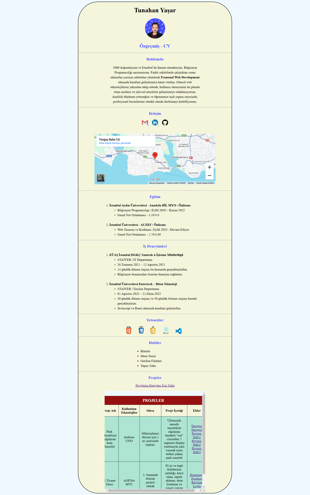

# 🌐 Kişisel Web Sayfası

[🇬🇧 İngilizce README.md için tıklayın](./README.md)

*Oluşturulma Tarihi: 3 Şubat 2025*

* Bu proje, Patika Frontend Bootcamp'i için oluşturulan **Hafta-1 / Odev-1 | HTML ve CSS** projesidir.
* Kişisel bilgilerimi, deneyimlerimi ve projelerimi sergileyen modern bir web sayfasıdır.
* **HTML5**, **CSS3** ve temel web teknolojileri kullanılmıştır.
* Responsive tasarım prensipleri uygulanmıştır.

---

## 🌐 Canlı Demo

Canlı siteyi ziyaret edin: [Kişisel Web Sayfası](https://summary-html.vercel.app/)

---

## :computer: Kullanım

1. Projeyi klonlayın
```bash
git clone https://github.com/tunahanyasar/summary-html.git
```

2. Proje klasörüne gidin
```bash
cd summary-html
```

3. `index.html` dosyasını bir web tarayıcısında açın
   - Dosyaya çift tıklayarak
   - Veya bir local server kullanarak (örn: Live Server VS Code eklentisi)

---

## 📋 Proje İçeriği

### 1. Ana Sayfa Yapısı
- Adımı ve fotoğrafımı sayfanın en üstüne ekledim
- Hakkımda kısmını **paragraf** etiketi içerisine doldurdum
  - Önemli yerleri **b** etiketi ile belirttim

### 2. İletişim Bölümü
- **a** etiketi ile ***mail, linkedin, github*** hesaplarımı yönlendirme yaparak ekledim
  - Görsel açıdan düzgün gözükmesi için hesapların logolarını **img** etiketi olarak ekledim
  - **Iframe** etiketi ile yaşadığım konumu google haritalardan çekerek sayfama ekledim

### 3. Eğitim ve Deneyim
- Eğitim kısmını ve İş Deneyimleri kısmını iç içe **ul** ve **ol** etiketilerini kullanarak ekledim
- Yeteneklerimi text olarak yazmak yerine edindiğim becerileri **img** ile görsel olarak ekledim
- Hobileri **ul** ile ekledim

### 4. Projeler Bölümü
- Projelerimi **a** etiketi ile yönlendirme ekleyerek ***projects.html*** içerisinde görüntüledim
  - Projeleri **Iframe** özelliği ile önbilgi vermesi açısından sayfama ekledim
  - ***projects.html*** içerisinde projelerimi tablo içersine yazarak **CSS** ile hizalama yaptım
    - Tablonun içerisine projeler hakkında **a etiketi** ile yönlendirmeli ek görseller ekledim

### 5. Stil ve Tasarım
- Projenin hizalı ve canlı gözükmesi için **head** etiketi altında **style** etiketinde özellikler yazdım
  - Küçük eklemeleri etiketlerin kendi içersinde **style** niteliği ile ekledim

---

## 💡 Kullanılan Teknolojiler

**HTML:**
* Semantic HTML5
* Meta Etiketleri
* Form Elemanları
* Iframe Entegrasyonu
* Link ve Resim Yönetimi

**CSS:**
* Responsive Design
* Flexbox Layout
* Custom Properties
* Media Queries
* Transform & Transitions

---

## 📸 Sayfa Çıktısı



---

## 🎯 Proje Hedefleri

1. **Kullanıcı Deneyimi**
   - Kolay navigasyon
   - Responsive tasarım
   - Modern görünüm

2. **İçerik Organizasyonu**
   - Düzenli bilgi hiyerarşisi
   - Görsel zenginlik
   - Kolay okunabilirlik

3. **Teknik Başarılar**
   - Semantic HTML kullanımı
   - CSS ile modern tasarım
   - Responsive yapı

---

## 📞 İletişim

[Tunahan Yaşar](https://github.com/tunahanyasar)

* GitHub: [@tunahanyasar](https://github.com/tunahanyasar)
* LinkedIn: [Tunahan Yaşar](https://www.linkedin.com/in/tunahan-yasar/) 
